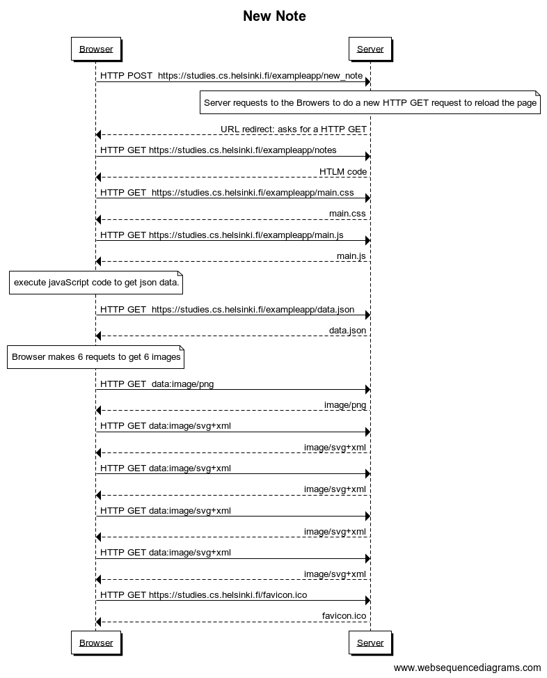

# Exercise 0.4: New Note.
When a user creates a new note in  https://studies.cs.helsinki.fi/exampleapp/notes, it produces 11 HTTP requets. 

The following diagram shows all the actions that occurs: 
